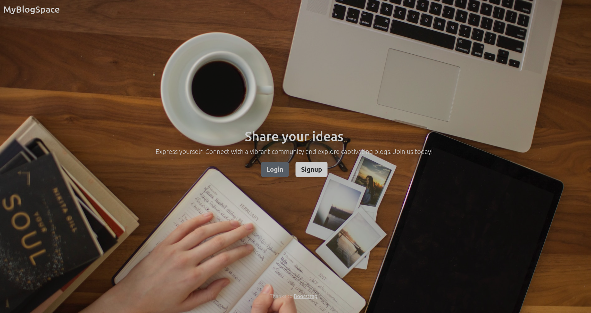
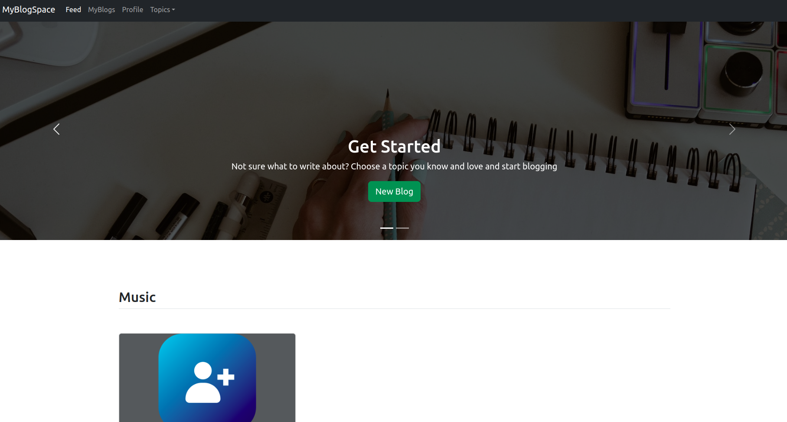

# My-Blog-Space

A webapp to view,write blogs on various topics. Bootstrap is the most popular HTML, CSS, and JavaScript framework for developing responsive, mobile-first websites.

## Frontend

* HTML
* CSS
* Javascript
* Bootstrap is used. Bootstrap is a popular HTML, CSS, and JavaScript framework for developing responsive, mobile-first websites.

## Backend

#### Java

#### Spring
The Spring Framework is an application framework and inversion of control container for the Java platform.

#### Spring MVC
A Spring MVC is a Java framework which is used to build web applications. It follows the Model-View-Controller design pattern. It implements all the basic features of a core spring framework like Inversion of Control, Dependency Injection.

#### Spring ORM with Hibernate
Hibernate ORM is an object–relational mapping tool for the Java programming language

## Database

#### MySQL

MySQL is an open-source relational database management system

## Web Server

#### Apache Tomcat(8.5)

Apache Tomcat is a web server and servlet container that's used to deploy and serve Java web applications.

## Hosting

AWS (Amazon Web Services)

## Features

* Login, Logout, signup, delete account for a user.
* User can view all blogs and also see blogs topicwise.
* User can create a new blog with a topic and an image.
* User can edit the blog afterwards or also delete the blog.

## Images

---
**NOTE**

i might change,reboot or terminate EC2 instance in AWS. So site might not be accesible sometimes.
---
